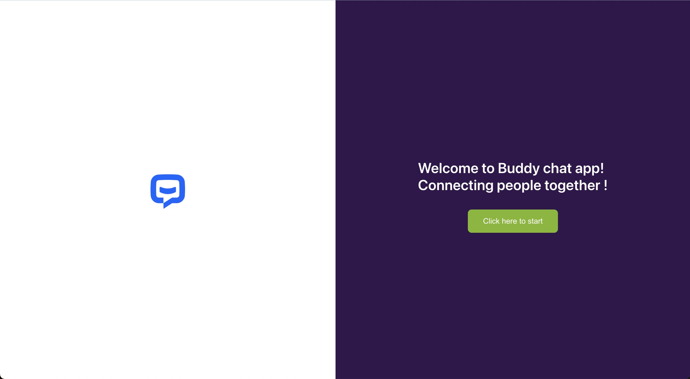

# Dashboard
   


<div align="center" >

</div>

## Installation
1. Clone the repo 
```sh
git clone https://github.com/SalmaaOsamaa/chat-bubble.git
```

2. install dependenscies
 ```bash
  npm i 
  ```
   
3. run this comand 
```bash
 npm start 

   ```

